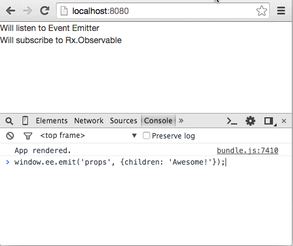

[](https://www.npmjs.com/package/react-reactive-class)

# React Reactive Class

With React Reactive Class, you can create Reactive Components, which
listen to events and re-render themselves.

`react-reactive-class` comes with a set of reactive DOM elements (button, div, span, etc) and a function to wrap your component to be a Reactive Component.

Once you created a Reactive Component, you pass a `props provider` to it, and it will listen to the provider, when the provider emits new props, Reactive Component will re-render itself.

You can use Event Emitter or Rx.Observable as `props provider`.

## Installation
```
npm install --save react-reactive-class
```

## Usage

### Use reactive DOM elements
```javascript
import React from 'react';
import {EventEmitter} from 'events';
import Rx from 'rx';

import {dom} from 'react-reactive-class';

const {div:Xdiv} = dom;

window.ee = new EventEmitter();
window.props$ = new Rx.Subject();

class App extends React.Component {
  render() {
    console.log('App rendered.');

    return (
      <div>
        <Xdiv ee={window.ee}>Will listen to Event Emitter</Xdiv>
        <Xdiv ee={window.props$}>Will subscribe to Rx.Observable</Xdiv>
      </div>
    );
  }
}

React.render(<App />, document.getElementById('app'));

// notice that App will not re-render, nice!
window.ee.emit('props', {children: 'Awesome!'});
window.ee.emit('props', {style: {color: 'red'}});
window.props$.onNext({style: {color: 'blue'}});
// you can open your console and play around
```



### Use reactive() function to wrap your component

#### ES5/ES5
```javascript
class Text extends React.Component {
  render() {
    console.log('Text rendered.');

    return (
      <div>{this.props.children}</div>
    );
  }
}

const XText = reactive(Text);
```

#### ES7
```javascript
@reactive
class XText extends React.Component {
  render() {
    console.log('Text rendered.');

    return (
      <div>{this.props.children}</div>
    );
  }
}
```

### Config Reactive Component
By default, the props provider attribute is `ee` and Reactive Component will listen to `props` event. You can custom those values.

> Event name has no effect when using Rx.Observable as props provider.

#### ES5/ES5
```javascript
const XText = reactive(Text, 'awesomeProvider', 'new-props');

<XText awesomeProvider={window.ee} />
window.ee.emit('new-props', {children: 'Awesome!'});
```

#### ES7
```javascript
@reactive('awesomeProvider', 'new-props')
class XText extends React.Component { ... }
```

## Feedbacks are welcome!
Feel free to ask questions or submit pull requests!

## License
The MIT License (MIT)
